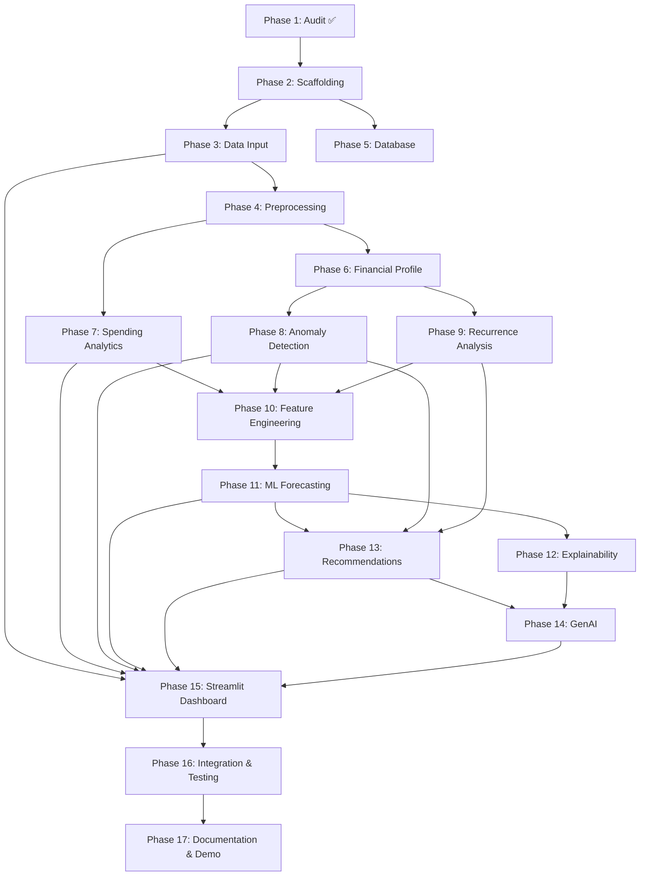

# IMPLEMENTATION PLAN: FinSight AI

> **Status**: Awaiting user approval before proceeding
> **Pre-requisite documents**: [PROJECT_AUDIT.md](file:///C:/Users/jyoth/.gemini/antigravity/brain/4a94b4d8-6619-40e6-9b85-2c774ea30172/PROJECT_AUDIT.md) | [FINSIGHT_ARCHITECTURE.md](file:///C:/Users/jyoth/.gemini/antigravity/brain/4a94b4d8-6619-40e6-9b85-2c774ea30172/FINSIGHT_ARCHITECTURE.md)

---

## User Review Required

> [!IMPORTANT]
> Please review the following decisions and open questions before I begin implementation.

## Open Questions

> [!IMPORTANT]
> **Q1 — Ollama / Llama 3.1 availability**: Do you already have Ollama installed with Llama 3.1 pulled on your machine? If not, when should I integrate GenAI — should I build the complete ML pipeline first and add Llama 3.1 at the end, or do you want me to set up Ollama early?

> [!IMPORTANT]
> **Q2 — Sample dataset**: I need to create a FinSight-specific sample transaction dataset (transaction-level: date, amount, category, payment_method, description). Should I generate a realistic synthetic dataset (~500–1000 transactions for 1–2 users over 12+ months)? Or do you have your own transaction data you'd like to use?

> [!IMPORTANT]
> **Q3 — Scope priority**: Given this is a final-year academic project with a demo deadline, which should I prioritize if time is constrained?
> - **Option A**: Full pipeline (all 17 phases) — comprehensive but slower
> - **Option B**: Core pipeline first (Phases 1–13) — ML + dashboard working, then add polish
> - **Option C**: Demo-ready minimum (data→forecast→recommendations→dashboard) — fastest to demo

> [!IMPORTANT]
> **Q4 — BudgetWise cleanup**: The cloned BudgetWise repo is at `d:\Major Project\Finsight\BudgetWise-Audit\`. Should I:
> - Keep it as a reference and build FinSight separately in `d:\Major Project\Finsight\`?
> - Or delete the clone once I've extracted what I need?

---

## Proposed Changes

### Phase 1: Repository Audit ✅ COMPLETE

- [x] Cloned and inspected BudgetWise repository
- [x] File-by-file analysis complete
- [x] ML pipeline assessed
- [x] Bugs and inconsistencies documented
- [x] [PROJECT_AUDIT.md](file:///C:/Users/jyoth/.gemini/antigravity/brain/4a94b4d8-6619-40e6-9b85-2c774ea30172/PROJECT_AUDIT.md) created
- [x] [FINSIGHT_ARCHITECTURE.md](file:///C:/Users/jyoth/.gemini/antigravity/brain/4a94b4d8-6619-40e6-9b85-2c774ea30172/FINSIGHT_ARCHITECTURE.md) created

---

### Phase 2: Project Scaffolding & BudgetWise Cleanup

**Goal**: Set up FinSight directory structure and extract reusable BudgetWise code

#### [NEW] `d:\Major Project\Finsight\app.py`
- Streamlit entry point with page configuration and sidebar navigation

#### [NEW] `d:\Major Project\Finsight\requirements.txt`
- Complete dependency list: pandas, numpy, scikit-learn, tensorflow, streamlit, plotly, ollama, python-dotenv, openpyxl, joblib

#### [NEW] `d:\Major Project\Finsight\.env.example`
- Template for environment variables (OLLAMA_HOST, DB_PATH, etc.)

#### [NEW] `d:\Major Project\Finsight\config\settings.py`
- Configuration constants, paths, category lists, thresholds

#### [NEW] Directory structure
```
FinSight/
├── app.py
├── requirements.txt
├── .env.example
├── config/settings.py
├── src/__init__.py
├── data/
├── models/
├── pages/
├── tests/
└── docs/
```

**Estimated effort**: Low

---

### Phase 3: Transaction Data Input System

**Goal**: Build CSV/Excel upload and manual entry functionality

#### [NEW] `src/data_input.py`
- `parse_csv(file)` → Validate and parse CSV uploads
- `parse_excel(file)` → Validate and parse Excel uploads
- `validate_transaction(row)` → Check date, amount, category validity
- `get_column_mapping(columns)` → Auto-detect or map column names

#### [NEW] `data/sample_transactions.csv`
- Synthetic but realistic Indian expense data
- ~500–1000 rows, 1–2 users, 12+ months
- Categories: Food, Transport, Rent, Utilities, Shopping, Medical, Entertainment, Education, Insurance, Subscriptions
- Payment methods: UPI, Cash, Card, Net Banking
- Include a few deliberate anomalies (₹2,00,000 medical bill, etc.)
- Include recurring expenses (rent, subscriptions)

**Estimated effort**: Medium

---

### Phase 4: Preprocessing Pipeline

**Goal**: Clean and normalize transaction data

#### [NEW] `src/preprocessing.py`
- `clean_transactions(df)` → Handle missing values intelligently
- `normalize_categories(df)` → Map user category names to standard categories
- `validate_dates(df)` → Ensure chronological order, parse formats
- `remove_duplicates(df)` → Detect and handle duplicate transactions
- `aggregate_monthly(df)` → Transaction-level → monthly summary
- `aggregate_by_category(df)` → Per-category monthly totals

**Adapted from**: BudgetWise `load_and_preprocess_data()` (improved NaN handling, added transaction-level support)

**Estimated effort**: Medium

---

### Phase 5: Database Layer

**Goal**: SQLite storage for all entities

#### [NEW] `src/database.py`
- `init_db()` → Create tables if not exist
- `add_user(username, income, budget, goal)` → Insert user
- `add_transactions(user_id, df)` → Bulk insert transactions
- `get_user_transactions(user_id)` → Retrieve transaction history
- `save_forecast(user_id, prediction, model)` → Store forecast
- `save_recommendations(user_id, recs)` → Store recommendations
- `get_user_profile(user_id)` → Retrieve user info

**Schema**: 6 tables as defined in [FINSIGHT_ARCHITECTURE.md](file:///C:/Users/jyoth/.gemini/antigravity/brain/4a94b4d8-6619-40e6-9b85-2c774ea30172/FINSIGHT_ARCHITECTURE.md)

**Estimated effort**: Medium

---

### Phase 6: Personal Financial Profile

**Goal**: Build a user-specific financial baseline

#### [NEW] `src/financial_profile.py`
- `build_profile(user_id, transactions, income, budget, goal)` → Compute:
  - Average monthly expense
  - Expense volatility (std)
  - Category distribution
  - Recurring expense total
  - Budget utilization rate
  - Spending trend (increasing/decreasing/stable)
- `compare_users(profile_a, profile_b)` → Show differences
- `get_baseline(profile)` → Return user's "normal" spending baseline

**Estimated effort**: Medium

---

### Phase 7: Spending Analytics

**Goal**: Category analysis, trends, patterns

#### [NEW] `src/spending_analytics.py`
- `category_breakdown(transactions)` → % per category
- `monthly_trends(transactions)` → Spending over time
- `budget_analysis(transactions, budget)` → Utilization, remaining, overspend
- `payment_method_analysis(transactions)` → Distribution by payment type
- `category_growth_rates(transactions)` → Month-over-month change per category
- `top_merchants(transactions)` → Most frequent/expensive merchants

**Adapted from**: BudgetWise `_create_features()` category ratio logic + new analytics

**Estimated effort**: Medium

---

### Phase 8: Anomaly Detection

**Goal**: Identify unusual transactions relative to user baseline

#### [NEW] `src/anomaly_detection.py`
- `detect_anomalies(transactions, profile)` → Statistical z-score method
  - Compute category-level mean and std from user history
  - Flag transactions with z-score > threshold (default 2.5)
  - Also flag if amount > 50% of monthly budget
- `classify_severity(z_score)` → Mild / Moderate / Severe
- `explain_anomaly(transaction, profile)` → Generate context string
- `get_anomaly_summary(transactions, profile)` → Dashboard-ready summary

**Estimated effort**: Medium

---

### Phase 9: Recurrence Analysis

**Goal**: Classify expenses as normal/unusual/one-time/recurring/persistent

#### [NEW] `src/recurrence_analysis.py`
- `detect_recurring(transactions)` → Find amount patterns with ±15% tolerance
- `classify_expense_type(transaction, history)` → NORMAL / UNUSUAL / ONE_TIME / RECURRING / PERSISTENT
- `check_persistence(anomalies, lookback_months)` → Is this anomaly repeating?
- `get_recurring_summary(transactions)` → List all detected recurring expenses
- `forecast_impact(classification)` → How should this affect the forecast?

**Estimated effort**: Medium

---

### Phase 10: Feature Engineering (ML-ready)

**Goal**: Create ML-ready features from transaction data, fixing BudgetWise data leakage

#### [NEW] `src/feature_engineering.py`
- `create_monthly_features(transactions, profile)` → Aggregate transactions into monthly feature vectors
- `add_temporal_features(df)` → Month_num, quarter, seasonal flags
- `add_user_features(df, profile)` → Budget utilization, expense ratios (from profile, NOT from future data)
- `add_trend_features(df)` → Rolling averages, slopes (expanding window, train-only)
- `add_anomaly_features(df, anomalies)` → Anomaly count, anomaly amount per month
- `add_recurrence_features(df, recurring)` → Recurring expense total per month
- `prepare_train_test(df, test_months)` → **Temporal split** (not random)

**Adapted from**: BudgetWise `_create_features()` — same concepts, fixed data leakage, added new features

**Estimated effort**: Medium–High

---

### Phase 11: ML Forecasting Pipeline

**Goal**: Train, evaluate, and compare 3 models; select best; predict future expenses

#### [NEW] `src/ml_forecasting.py`
- `train_linear_regression(X_train, y_train)` → Train + return model
- `train_random_forest(X_train, y_train)` → Train RF (n_estimators=100)
- `train_lstm(X_train, y_train, sequence_length)` → Train LSTM with temporal sequences
- `evaluate_model(model, X_test, y_test)` → Return MAE, RMSE, R²
- `compare_models(models_dict, X_test, y_test)` → DataFrame of all metrics
- `select_best_model(results)` → Return best model by MAE
- `save_model(model, path)` → Joblib serialization
- `load_model(path)` → Load saved model
- `predict_next_month(model, latest_features)` → Single-month forecast

**Adapted from**: BudgetWise `train_models()`, `evaluate_models()`, `forecast_future_expenses()` — fixed temporal split, dynamic model selection, proper scaling

**Estimated effort**: Medium–High

---

### Phase 12: Model Explainability

**Goal**: Show why the model made its prediction

#### [NEW] `src/explainability.py`
- `get_feature_importance(model, feature_names)` → RF importance or LR coefficients
- `explain_prediction(model, features, feature_names)` → Top contributing factors
- `format_explanation(importance_dict, prediction)` → Human-readable string

**Estimated effort**: Low

---

### Phase 13: Recommendation Engine

**Goal**: Personalized, context-aware financial recommendations

#### [NEW] `src/recommendations.py`
- `generate_recommendations(prediction, profile, anomalies, recurring, trends)` → List of recommendations
- Rules:
  - Budget overspend warning (predicted > budget)
  - Category trend alerts (category growth > 15%)
  - Anomaly context (explain unusual transactions)
  - Savings opportunities (high-ratio categories)
  - Goal progress tracking
  - Recurrence notices
- `prioritize_recommendations(recs)` → Sort by priority
- `format_for_display(recs)` → Streamlit-ready format

**Adapted from**: BudgetWise `generate_budget_recommendations()` — extended from 4 rules to 6+ rule categories, added anomaly/recurrence context

**Estimated effort**: Medium

---

### Phase 14: Generative AI Integration

**Goal**: Llama 3.1 via Ollama for natural language explanations

#### [NEW] `src/genai_assistant.py`
- `check_ollama_connection()` → Verify Ollama is running
- `build_financial_context(profile, prediction, anomalies, recommendations)` → Structured context string
- `explain_prediction(context)` → LLM explains the forecast
- `explain_anomaly(anomaly, profile)` → LLM explains why a transaction is unusual
- `explain_recommendations(recommendations, context)` → LLM elaborates on recommendations
- `financial_chat(user_message, context)` → Interactive Q&A about user's finances
- `validate_llm_output(response, context)` → Check LLM didn't invent numbers

**Requires**: Ollama installed with Llama 3.1 pulled

**Estimated effort**: High

---

### Phase 15: Streamlit Dashboard

**Goal**: 9-page interactive dashboard

#### [NEW] `app.py` — Main entry point
- Page config, sidebar, session state management

#### [NEW] `pages/1_User_Profile.py`
- Income, budget, goal input form
- Financial profile summary display

#### [NEW] `pages/2_Upload_Transactions.py`
- CSV/Excel file uploader
- Manual entry form
- Data preview table
- Upload confirmation

#### [NEW] `pages/3_Expense_Dashboard.py`
- Total spending card, budget utilization gauge
- Category breakdown (Plotly pie/bar)
- Monthly trend line chart
- Recent transactions table

#### [NEW] `pages/4_Spending_Analysis.py`
- Category-level deep dive
- Payment method distribution
- Category growth rates
- Monthly comparison

#### [NEW] `pages/5_Anomaly_Detection.py`
- Flagged transactions table with severity indicators
- Anomaly explanation cards
- Historical anomaly timeline

#### [NEW] `pages/6_Forecast.py`
- Prediction display with confidence
- Model comparison table (MAE, RMSE, R²)
- Feature importance chart
- Prediction explanation

#### [NEW] `pages/7_Recommendations.py`
- Priority-sorted recommendation cards
- Savings potential summary
- Goal progress tracker

#### [NEW] `pages/8_AI_Assistant.py`
- Chat interface (Streamlit chat component)
- Pre-built quick questions
- Financial context-aware responses

**Estimated effort**: High

---

### Phase 16: End-to-End Integration & Testing

**Goal**: Wire everything together, test the full pipeline

- [ ] End-to-end flow: Upload → Profile → Analytics → Anomaly → Forecast → Recommend → Explain
- [ ] Demo scenario: Income ₹30,000, Budget ₹22,000, upload transactions, see prediction ₹23,400
- [ ] Special test case: ₹2,00,000 medical expense — verify anomaly detection, recurrence check, forecast impact
- [ ] Error handling for edge cases (empty uploads, missing columns, no history)
- [ ] Session state management across Streamlit pages

**Estimated effort**: Medium

---

### Phase 17: Documentation & Final Demo

**Goal**: Complete project documentation

#### [NEW/UPDATE] `README.md`
- Project overview, setup instructions, screenshots, architecture diagram

#### [NEW] `docs/architecture_diagram.md`
- Mermaid diagrams for system architecture, data flow, UML

#### [NEW] Demo preparation
- Demo script following the 8-step scenario from the project brief
- Special test case (₹2,00,000 medical expense)

**Estimated effort**: Medium

---

## Verification Plan

### Automated Tests
```bash
# Run unit tests
python -m pytest tests/ -v

# Verify ML pipeline
python -c "from src.ml_forecasting import *; print('ML module OK')"

# Verify Streamlit app starts
streamlit run app.py --server.headless true
```

### Manual Verification
1. Upload sample CSV → Verify data appears in dashboard
2. Check anomaly detection flags the ₹2,00,000 medical expense
3. Verify ML models train and produce reasonable MAE/RMSE/R²
4. Check that the best model is dynamically selected (not hardcoded RF)
5. Verify recommendations reference actual data (no fabricated numbers)
6. Test Ollama/Llama 3.1 chat produces contextual responses
7. Walk through the full 8-step demo scenario end-to-end

---

## Phase Dependencies



---

## Estimated Timeline

| Phase | Description | Est. Complexity |
|-------|-------------|----------------|
| 1 | Audit | ✅ Complete |
| 2 | Scaffolding | 🟢 Low |
| 3 | Data Input | 🟡 Medium |
| 4 | Preprocessing | 🟡 Medium |
| 5 | Database | 🟡 Medium |
| 6 | Financial Profile | 🟡 Medium |
| 7 | Spending Analytics | 🟡 Medium |
| 8 | Anomaly Detection | 🟡 Medium |
| 9 | Recurrence Analysis | 🟡 Medium |
| 10 | Feature Engineering | 🟠 Medium-High |
| 11 | ML Forecasting | 🟠 Medium-High |
| 12 | Explainability | 🟢 Low |
| 13 | Recommendations | 🟡 Medium |
| 14 | GenAI Integration | 🔴 High |
| 15 | Streamlit Dashboard | 🔴 High |
| 16 | Integration & Testing | 🟡 Medium |
| 17 | Documentation & Demo | 🟡 Medium |
