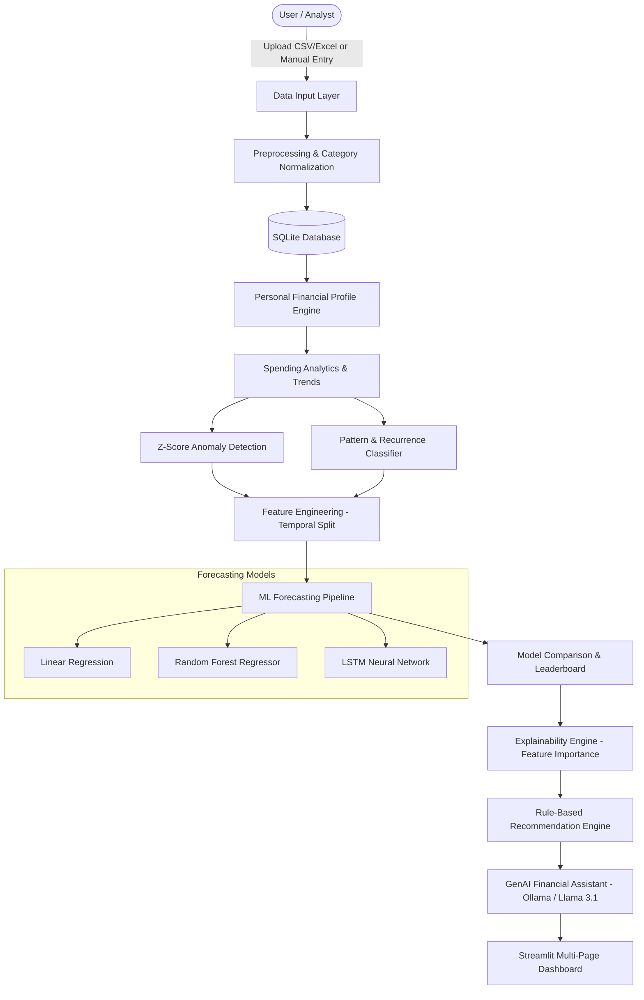

# 💰 FinSight AI
### AI-Powered Personal Finance Intelligence & Expense Forecasting System

[](https://www.python.org/)
[](https://streamlit.io/)
[](https://scikit-learn.org/)
[](https://www.sqlite.org/)
[](https://plotly.com/)
[](LICENSE)

---

## 📌 1. Project Overview

**FinSight AI** is an intelligent personal finance platform that bridges **classical machine learning (time-series expense forecasting, anomaly detection)** with **Generative AI (financial literacy and personalized coaching)**.

Designed as an end-to-end engineering solution, FinSight AI processes user transaction records, detects spending volatility, flags irregular or one-time expenditures (e.g., medical emergencies), evaluates multiple predictive models without data leakage, and provides actionable recommendations to keep users within their monthly budgets.

---

## 🏛️ 2. System Architecture



---

## ✨ 3. Core Features

| Module | Features & Capabilities |
| :--- | :--- |
| **User Profile Management** | Define monthly income, budget, and savings targets; builds user-specific financial personas. |
| **Transaction Intake** | Batch CSV/Excel upload with dynamic 50+ alias category mapping and manual transaction input. |
| **Interactive Dashboard** | KPI metric cards, budget gauges, dynamic Plotly category breakdowns, and monthly trends. |
| **Spending Analytics** | Channel analysis (UPI, Card, Net Banking, Cash), category growth velocities, and spend patterns. |
| **Anomaly Detection** | Statistical Z-score detection with severity categorization (Mild, Moderate, Severe) to isolate unexpected spikes. |
| **Recurrence Analysis** | Pattern matching with $\pm 15\%$ tolerance variance to identify fixed commitments (Rent, EMIs, Subscriptions). |
| **ML Expense Forecasting** | Multi-model evaluation comparing Linear Regression, Random Forest, and LSTM using strictly temporal train-test splits. |
| **Model Explainability** | Renders top contributing drivers behind predicted expenditure increases. |
| **Personalized Recommendations** | Actionable financial nudges prioritized by urgency and potential savings impact. |
| **GenAI Financial Assistant** | Conversational agent powered by Llama 3.1 via Ollama (with offline rule fallbacks). |

---

## 📂 4. Project Directory Structure

```
FinSight/
├── app.py                         # Application Entry Point (Streamlit)
├── requirements.txt               # Project Dependencies
├── .gitignore                     # Git Exclusions
├── .env.example                   # Environment Configuration Template
├── generate_ppt.py                # Academic Review Presentation Generator
│
├── config/
│   └── settings.py                # Global Constants, Thresholds & Paths
│
├── data/
│   ├── sample_transactions.csv    # 560-row Synthetic Indian Financial Dataset
│   └── generate_sample_transactions.py # Dataset Generator Script
│
├── models/                        # Directory for Serialized Models (.joblib)
│
├── pages/                         # Multi-Page Streamlit Frontend
│   ├── 1_User_Profile.py
│   ├── 2_Upload_Transactions.py
│   ├── 3_Expense_Dashboard.py
│   ├── 4_Spending_Analysis.py
│   ├── 5_Anomaly_Detection.py
│   ├── 6_Forecast.py
│   ├── 7_Recommendations.py
│   └── 8_AI_Assistant.py
│
├── src/                           # Backend Business Logic & ML Engines
│   ├── data_input.py
│   ├── preprocessing.py
│   ├── database.py
│   ├── financial_profile.py
│   ├── spending_analytics.py
│   ├── anomaly_detection.py
│   ├── recurrence_analysis.py
│   ├── feature_engineering.py
│   ├── ml_forecasting.py
│   ├── explainability.py
│   ├── recommendations.py
│   └── genai_assistant.py
│
└── BudgetWise-Audit/              # Pre-upgrade Legacy Prototype & Audit Docs
```

---

## 🚀 5. Quick Start Guide

### Prerequisites
* **Python 3.10+** (Tested on Python 3.10, 3.11, 3.13)
* **Git** installed on your system
* *(Optional)* **Ollama** with `llama3.1` pulled for local generative AI features.

### Installation

1. **Clone the repository**:
   ```bash
   git clone https://github.com/JyothiSriLakshmi-1305/FinSight-AI.git
   cd FinSight-AI
   ```

2. **Create and activate a virtual environment**:
   ```bash
   python -m venv venv
   # On Windows:
   venv\Scripts\activate
   # On macOS/Linux:
   source venv/bin/activate
   ```

3. **Install dependencies**:
   ```bash
   pip install -r requirements.txt
   ```

4. **Run the Streamlit application**:
   ```bash
   streamlit run app.py
   ```

5. Access the app in your browser at `http://localhost:8501`.

---

## 🧪 6. Testing & Demonstration Workflow

For project reviews and live demonstrations, follow this sequence:
1. Open **Page 1 (User Profile)** $\rightarrow$ Create profile (Income: ₹50,000, Budget: ₹35,000).
2. Open **Page 2 (Upload Transactions)** $\rightarrow$ Click **"Load Sample Dataset"** to ingest 560 curated transactions.
3. Open **Page 3 (Expense Dashboard)** $\rightarrow$ Review total spending, budget utilization, and category shares.
4. Open **Page 5 (Anomaly Detection)** $\rightarrow$ Inspect detected irregular transactions (e.g. medical emergency expense).
5. Open **Page 6 (Forecast)** $\rightarrow$ Click **"Train Models & Generate Forecast"** to compare Linear Regression and Random Forest models and view feature importance.
6. Open **Page 7 (Recommendations)** $\rightarrow$ Inspect savings recommendations.
7. Open **Page 8 (AI Assistant)** $\rightarrow$ Ask financial questions or generate contextual insights.

---

## 📄 7. License & Credits

Developed as a Major Project in Computer Science and Engineering.  
Distributed under the **MIT License**.
